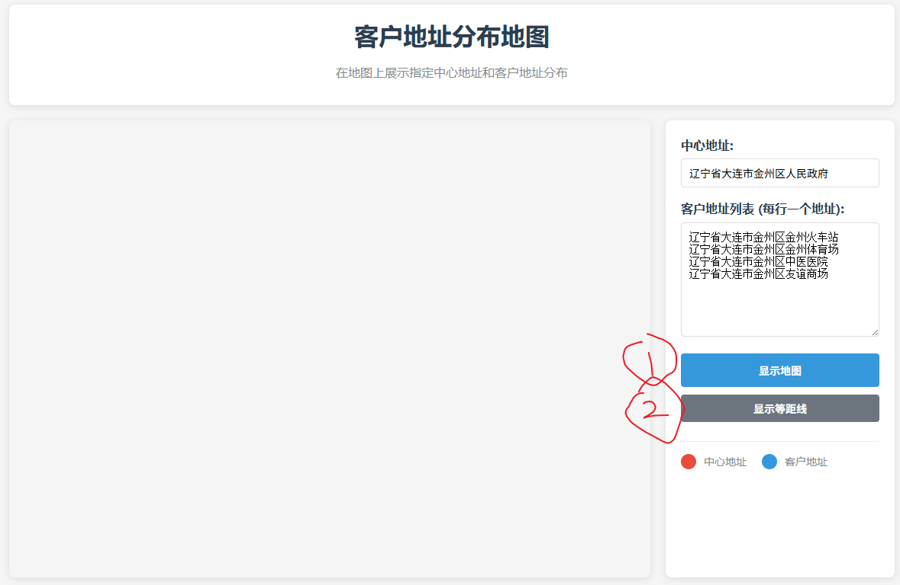
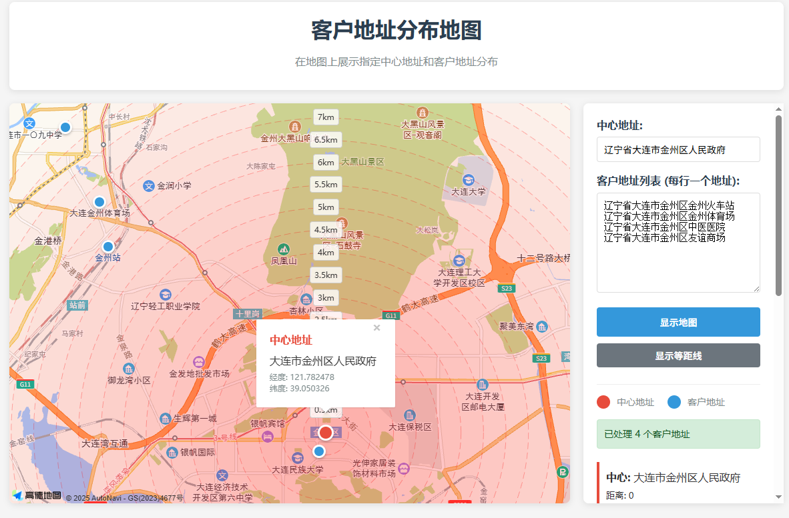
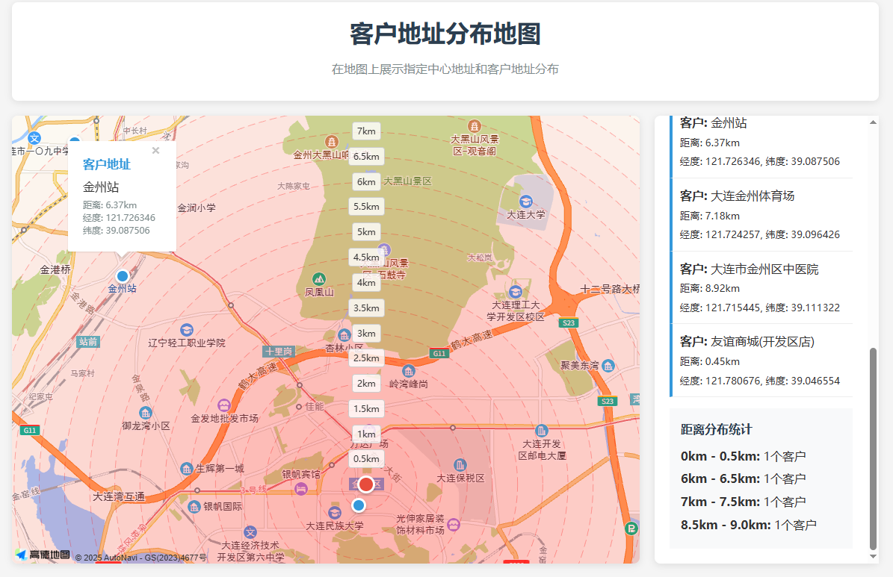

# 客户地址分布地图

该项目允许您在交互式地图上可视化客户地址的分布。您可以输入一个中心地址和一组客户地址，应用程序将把它们绘制在地图上。此外，应用会计算并显示中心与客户地址之间的距离，并提供显示等距圆圈的选项，帮助更好地理解客户分布。

## 功能：
- **设置中心地址**：输入您想要与客户地址进行比较的中心位置。
- **客户地址输入**：输入或上传一组客户地址。
- **地图可视化**：在地图上展示客户地址和中心地址。
- **距离计算**：计算中心与每个客户地址之间的距离。
- **显示等距圆圈**：可以选择显示从中心点起步的等距圆圈，帮助更直观地了解客户分布。

## 截图：

### 1. 主界面


### 2. 显示客户地址的地图


### 3. 距离统计


## 使用方法：
1. 在输入框中输入中心地址。
2. 在文本区域中输入客户地址（每行一个），或者上传包含客户地址的文件。
3. 点击“显示地图”以加载地图上的地址。
4. 可选：点击“显示等距线”以展示从中心点起步的距离圆圈。

## 配置 API 密钥：
该项目使用了高德地图 API，需要填写两个 API 密钥以便正常使用。

### 步骤：
1. 打开项目中的 HTML 文件 (`index.html`)。
2. 在 `<head>` 部分找到以下脚本标签：

   ```html
   <script type="text/javascript">
       window._AMapSecurityConfig = {
           securityJsCode: "YOUR_SECURITY_JS_CODE",
       }
   </script>
   ```
在 YOUR_SECURITY_JS_CODE 中填写您的 高德地图 API 安全 JS 代码。
3. 在 <body> 部分，找到以下地图 API 引入代码：
```html
<script src="https://webapi.amap.com/maps?v=1.4.15&key=YOUR_API_KEY&plugin=AMap.Geocoder,AMap.PlaceSearch"></script>
```
在 YOUR_API_KEY 中填写您的 高德地图 API 密钥。

### 使用技术：
- HTML/CSS 用于页面结构和样式。
- JavaScript 用于地图交互和地址处理。
- AMap API 用于地图渲染和地理编码。

### 设置：
要在本地使用该应用，请按照以下步骤操作：
1. 克隆该仓库。
2. 在浏览器中打开 index.html 文件。


**说明：**
- 请将 `YOUR_SECURITY_JS_CODE` 替换为您从高德地图控制台获取的 **安全 JS 代码**。
- 请将 `YOUR_API_KEY` 替换为您从高德地图控制台获取的 **API 密钥**。
